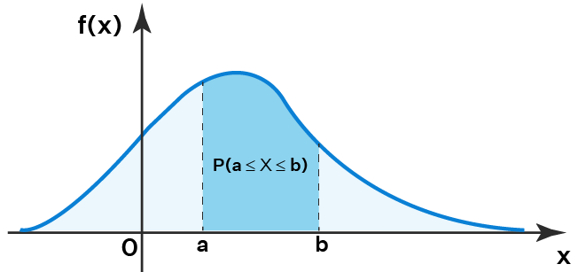
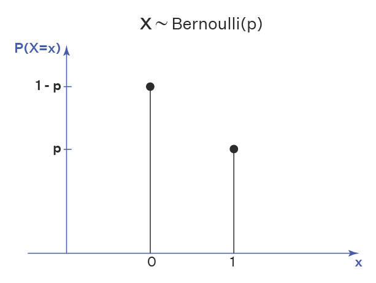
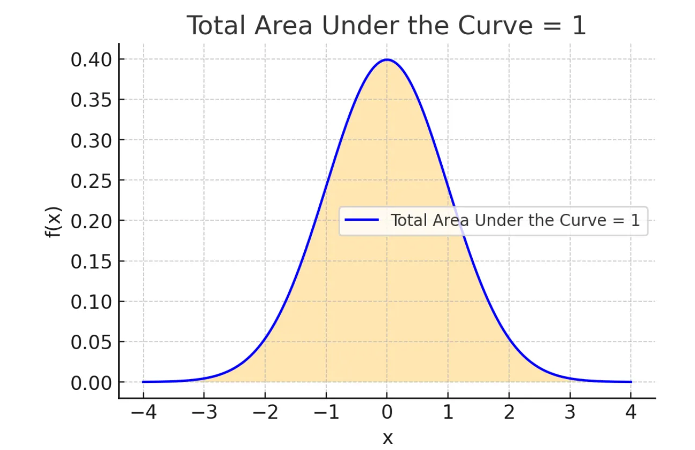

## Previous Chapter 

[Introduction to Probability](prob_ch1_intro.html)

# Concepts

<script>
function klikaj(i) {
    document.getElementById(i).style.visibility='visible';
}
</script>

## Random Variable 

- Discrete
- Continuous 

Guess which

> - No. of people dying each day
> - Number of heads in successive tosses.
> - Heights of people in Bangladesh
> - GPA of students
> - Grade of students in individual subjects
> - Income tax paid by people

## Integration

- $\int x^3+2x$
- $\int_2^3 x^2+x$
- Relationship between integration (I) and differentiation(D).  

<div onclick="klikaj('intd')"><span>Answer</span></div>
<div id="intd" style="visibility: hidden">
$f(x) \to I \to D \to f(x)$

Test with $f(x) = x^2$
</div>

# Probability Distribution

# Example

Results of an unbiased die throw

| x |      1      |      2      |      3      |      4      |      5      |      6      |
|:-:|:-----------:|:-----------:|:-----------:|:-----------:|:-----------:|:-----------:|
| P | $\frac 1 6$ | $\frac 1 6$ | $\frac 1 6$ | $\frac 1 6$ | $\frac 1 6$ | $\frac 1 6$ |

Biased

| x |      1      |      2      |      3      |      4      |      5      |      6      |
|:-:|:-----------:|:-----------:|:-----------:|:-----------:|:-----------:|:-----------:|
| P | $\frac 1 7$ | $\frac 2 7$ | $\frac 1 7$ | $\frac 1 7$ | $\frac 1 7$ | $\frac 1 7$ |

## Number of Heads in Coin Toss

A coin is tossed twice

S = {HH, HT, TH, TT}

> - X = number of heads in the tosses
> - What are the possible values of x?
> - x = 0, 1, 2 

Fill the probabilities

|   x  | 0 | 1 | 2 |
|:----:|:-:|:-:|:-:|
| p(x) |   |   |   |

> - **N:B: X is variable & x is value**

## PDF vs PMF Curve

<div class="container">
<div class="col">
PDF 



Continuous
</div>
<div class="col">
PMF



Discrete
</div>
</div>

## PDF and PMF Conditions


<div class="container">
<div class="col">
PDF 


<small> Source: [upgrad.com](https://www.upgrad.com/blog/introduction-to-probability-density-function/?source=docs.statmania.info) </small>

> - $0 \le f(x) \le 1$
> - $\displaystyle \int_{-\infty}^\infty f(x)dx = 1$

</div>
<div class="col">
PMF

```{r, echo=FALSE, fig.height=3, fig.width=4}
# Define your data
x = 0:6
px = c(0.1, 0.02, 0.3, 0.4, 0.13, 0.03, 0.02)

par(mar = c(3, 3, 2, 1) + 0.1) # Reduced margins, +0.1 is a common small adjustment

# Create the initial plot
plot(x, px,
     type = "h",      # "h" for histogram-like vertical lines
     xlab = "Value (x)",
     ylab = 'Probability',
     ylim = c(0, 0.5), # Ensure enough space above the highest point for labels
     lwd = 2,         # Line width
     col = "darkblue" # Line color (optional)
     )

# Add the probability values as text labels above the lines
text(x = x,             # X-coordinates for the text (same as line x)
     y = px + 0.02,     # Y-coordinates for the text (px value + a small offset)
     labels = px,       # The actual text to display (your px values)
     cex = 0.8,         # Character expansion: makes the text 80% of default size
     col = "red",       # Color of the text (optional, but good for visibility)
     pos = 3            # Position: 3 means above the coordinate (optional, but good practice)
     )
par(mar = c(5.1, 4.1, 4.1, 2.1))
```
<small>

> - $0 \le P(X=x) \le 1$
> - $\sum P(x_i) = 1$
> - Thus the sum of all possible outcomes is zero

</small>
</div>
</div>


## PDF and PMF Properties

<div class="container">
<div class="col">
Probability Density Function (continuous)

> - $\displaystyle \int_{{\, - \infty }}^{{\,\infty }}{{f\left( x \right)\,dx}} = 1$
> - $P\left( {a \le X \le b} \right) = \int_{{\,a}}^{{\,b}}{{f\left( x \right)\,dx}}$
> - $P(X=x)=0$ (theoretically, why?)

</div>
<div class="col">
Probability Mass Function (discrete)

> - $\displaystyle \sum_{{\, - \infty }}^{{\,\infty }}{{f\left( x \right)\,dx}} = 1$
> - $P_x(X) = P(X=x)$
</div>
</div>

## PMF Problem 01

Given, $P(x) = \frac{2x+k}{56}; x = -3, -2, -1, 0, 1, 2, 3$

Discrete or Continuous?

> - k = ?
> - Find probability of each value of x
> - Find $P(-2 \le x \le 2)$


## Pdf problem 01

$f\left( x \right) = \frac{{{x^3}}}{{5000}}\left( {10 - x} \right)$ $for 0 \le x \le 10$ and $f\left( x \right) = 0$ for all other values. 

a. Show that $f\left( x \right)$ is a probability density function.
b. Find $P\left( {1 \le X \le 4} \right)$
c. Find $P\left( {x \ge 6} \right)$ 

> - is it $\displaystyle \int_{7}^{10} f(x) dx$?

## Pdf problem 02

$f(x) = k(x+1); 0\lt x \lt 1$

i. $P(X=2)=?$
ii. $k=?$
iii. $P(0.4 \lt X \lt 2)=?$

> - $\int_{0.4}^1 f(x) + \int_{1}^2 f(x) \to 0$

## Cumuluative Distribution Function 

**F(x)** or cdf accumulates all of the probability less than or equal to.

|   x   |      1      |      2      |      3      |      4      |      5      |      6      |
|:-----:|:-----------:|:-----------:|:-----------:|:-----------:|:-----------:|:-----------:|
| P (x) | $\frac 1 7$ | $\frac 1 7$ | $\frac 1 2$ | $\frac 1 7$ | $\frac 1 7$ | $\frac 1 7$ |
| F (x) | $\frac 1 7$ | $\frac 2 7$ | $\frac 4 7$ | $\frac 5 7$ | $\frac 6 7$ |     $1$     |

Find 

1. $P(X<4)$
2. $P(3<X<6)$

## cdf definition 

$F_X(x) = P(X\le x)$

<div class="container">
<div class="col">
Discrete

$$F(x) = \sum_{X\le x} P(x)$$
</div>
<div class="col">
Continuous
<small>

> - $$F_{X}(x) = \int_{-\infty}^x f_X(t)dt$$
> - Find cdf for $f(x) = 2x; 0\le x \le 1$
> - $\int \to x^2$

<div onclick="klikaj('Fx')"><span>Answer</span></div>
<div id="Fx" style="visibility: hidden">
\begin{eqnarray}
F(x) =
\begin{cases}
x^2/2,  & 0\le x \le 1 \\
0, & \text{otherwise}
\end{cases}
\end{eqnarray}
</small>
</div>

</div>
</div>

## cdf properties

> - $P(a\le x \le b) = F(b)-F(a)$for $a\lt b$; what if $a \lt x \lt b?$ 
> - For continuous x, $f(x) = \frac{d}{dx}[F(x)]$
> - $F(-\infty) =0 , F(+\infty) = 1$

## Joint Probability Function

Let, $I = Infected$, and $V = Vaccinated$

|          | $I$ | $\bar I$ | Total |
|:--------:|:---:|:--------:|:-----:|
|    $V$   |  3  |    276   |  279  |
| $\bar V$ |  66 |    473   |  539  |
|   Total  |  69 |    749   |  818  |

Find the probability that

1) a vaccinated person is infected
2) a non-vaccinated person is uninfected

> - These are joint probabilities $\to$ P(x,y)
> - $P(x,y) =P(x) \cdot P(y)$ if $x$ and $y$ are independent. 

## Joint-Marginal-Conditional

<small>

Let, $I = Infected$, and $V = Vaccinated$

|          | $I$ | $\bar I$ | Total |
|:--------:|:---:|:--------:|:-----:|
|    $V$   |  3  |    276   |  279  |
| $\bar V$ |  66 |    473   |  539  |
|   Total  |  69 |    749   |  818  |

Find the probabilities that
<div class="container">
<div class="col">

<div onclick="klikaj('jmc1')"> 1. a vaccinated person is infected</div>
<div onclick="klikaj('jmc2')"> 2. a non-vaccinated person is uninfected</div>
<div onclick="klikaj('jmc3')">  3. vaccinated if infected</div>
<div onclick="klikaj('jmc4')"> 4. infected if not vaccinated</div>
<div onclick="klikaj('jmc5')">  5. vaccinated</div>
<div onclick="klikaj('jmc6')"> 6. uninfected</div>
</div>
<div class="col">
<u>Answers</u>

<div id="jmc1" style="visibility: hidden">
1. Joint $\to P(V\cap I)$
</div>
<div id="jmc2" style="visibility: hidden">
2. Joint $\to P(\bar V\cap \bar I)$
</div>
<div id="jmc3" style="visibility: hidden">
3. Conditional $\to P(V | I)=\frac{P(V \cap I)}{P(I)}$
</div>
<div id="jmc4" style="visibility: hidden">
4. Conditional
</div>
<div id="jmc5" style="visibility: hidden">
5. Marginal $\to P(V)$
</div>
<div id="jmc6" style="visibility: hidden">
6. Marginal $\to P(\bar I)$
</div>
</div>
</div>

</small>

## Joind PF Properties

- $P(x,y) \ge 0$
- $\Sigma\Sigma P(x,y)=1$ 

## Coin-Die

| Die/Coin |  1 |  2 |  3 |  4 |  5 |  6 |
|:--------:|:--:|:--:|:--:|:--:|:--:|:--:|
|   H (1)  | H1 | H2 | H3 | H4 | H5 | H6 |
|   T (0)  | T1 | T2 | T3 | T4 | T5 | T6 |

X = Outcome of coin toss

Y = Outcome of die throw

x = 0, 1; y = 1, 2, 3, 4, 5, 6 

Construct the distribution.

## Joint-Marginal-Conditional Revisited

| Exam (X) $\to$<br>Result (Y) $\downarrow$ |   PSC  |   JSC  |   SSC  |   HSC  |  Total  |
|:-----------------------------------------:|:------:|:------:|:------:|:------:|:-------:|
|                   Passed                  |   30   |   26   |   23   |   25   | **104** |
|                   Failed                  |   12   |   13   |   10   |   14   |  **49** |
|                   Absent                  |    5   |    2   |    3   |    4   |  **14** |
|                 **Total**                 | **47** | **41** | **36** | **43** | **167** |

> - Marginal: $P(Pass) = P(x_1)=P(x_1,y_1)+P(x_1,y_2)+P(x_1,y_3)$
> - $P(Absent) = P(x_3) = P(x_3,y_1)+P(x_3,y_2)+P(x_3,y_3)$

## Marginal Probability


Consider the previous table

Joint probability: $P(x_i, y_j); i = 1,2, \cdots m; j = 1,2, \cdots n$

Marginal probability $\to P(x_i) \leftarrow P(x_i, y_j)$

> - For x: $\displaystyle P(x_i) = \sum_{j=1}^n P(x_i, y_j); i = 1,2, \cdots m$ 
> - For y: $\displaystyle P(y_i) = \sum_{i=1}^m P(x_i, y_j); j = 1,2, \cdots n$ 
> - What about continuous x?

## Marginal Probability Properties 

- $P(x_i) \ge 0$ and $P(y_i) \ge 0$
- $$\sum_{i=1}^m P(x_i)=\sum_{j=1}^n P(y_j)=1$$

Summing marginal probabilities will give 1. 

## Joint-Marginal Example

$P(x,y) = \frac{x+y}{9}; x=0,1,2; y = 0, 1$

- Find marginal probabilities
- Check properties (sum)

> - $P(x) = \frac{2x+1}{9}$

## Conditional Probability Function

Like Bayes Theorem

$P(X_i|y_j) = \frac{P(x_i,y_j)}{P(y_j)}; P(y_j) \gt 0$

Properties

> - $\sum_{j=1}^m P(x_i|y_j)=\sum_{i=1}^m P(y_j|x_i)=1$

## Conditional Probability Example

$P(x,y) = \frac{x+y}{9}; x=0,1,2; y = 0, 1$

Find $P(X|Y)$ and $P(Y|X)$ 

Find for continuous X as well. 

## Find k for pdf

$f(x) = kx^2+kx+\frac 1 8; 0 \lt x \lt 2$

1. Find k
2. Find $P(1 \lt X \lt 2)$

## Next Chapter

[Mathematical Expectation](03-expectation.html)