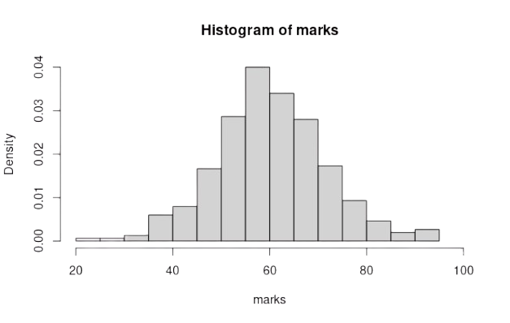

# Why? 

> - Have you heard about moments? 

> - Why are they Used?

# Revisit Histogram



# Moments

Can uniquely characterize a distribution

## Central Moments

Central Moments: $\mu_r=\frac{\sum(x_i-\bar x)^r}{n}$

> - $\mu_1=\frac{\sum(x_i-\bar x)}{n}=\frac{\sum x_i}{n}-\frac{n \bar x}{n}=\frac{n \bar x}{n}-\frac{n \bar x}{n}=0$

> - $\mu_2=\frac{\sum(x_i-\bar x)^2}{n}=\sigma^2$
> - $\mu_3=\frac{\sum(x_i-\bar x)^3}{n}$
> - $\mu_4=\frac{\sum(x_i-\bar x)^4}{n}$
> - For grouped data: $\mu_r=\frac{\sum f_i(x_i-\bar x)^r}{n}$


## Raw Moments

 $\mu_r'=\frac{\sum(x_i-a)^r}{n}$; a is arbitrary number
 
 $\mu_1'=\frac{\sum(x_i-a)}{n}=\frac{\sum x_i}{n}-\frac{na}{n}=\bar x-a$
 
## Value of 1st Central Moment

$\displaystyle \mu_1=\frac{\sum (x_i-\bar x)}{n}=\frac{\sum x_i}{n}=\bar x - \bar x = 0$


## Binomial Formula from Pascal Triangle


Coefficients using the triangle

1. $(a+b)^1 = a + b$
2. $(a+b)^2 = a^2 + 2ab + b^2$
2. $(a+b)^3=a^3+3a^2b+3ab^2+b^3$
3. $(a+b)^4=a^4+4a^3b+6a^2b^2+4ab^3+b^4$

## Changing Origin of Moments

From $\mu_r'(a)$ to $\mu_r'(k)$

Assume, $a^r = \mu_r'(a)$, $b = a - k$ 

<small>
<div class="container">
<div class="col">
Binomial Formulae

1. $(a+b)^1 = a + b$
2. $(a+b)^2 = a^2 + 2ab + b^2$
2. $(a+b)^3=a^3+3a^2b+3ab^2+b^3$
3. $(a+b)^4=a^4+4a^3b+6a^2b^2+4ab^3+b^4$
</div>
<div class="col">
> - 1. $\mu_1'(k) = \mu_1'(a) + b$
> - 2. $\mu_2'(k) = \mu_2'(a) + 2 \mu_1'(a)b + b^2$
> - 3. ?
> - 4. ?
</div>
</div>
</small>

[See Examples](#/moments-conversion-problems)

## Central Moments from Raws

Use $k = \bar x$

That's it! DO NOT MEMORIZE!

## 2nd Central Moment

$\mu_2=\mu_2' - \mu_1'^2$

> - $\mu_2=\mu_2'(a)+2\mu_1'(a)(a-\bar x)+(a-\bar x)^2$ [From [here](#/changing-origin-of-moments)]
> - $\mu_2'-2(a-\bar x)^2+(a-\bar x)^2$ [since $\mu_1'(a) = \bar x-a$]
> - $\mu_2'-(a-\bar x)^2$
> - $\mu_2' - \mu_1'^2$

## Chracteristics of Moments

<p style="font-size=13px;">

> - Used for testing for symmetry, normality, and skewness
> - First raw moment around zero is Arithmetic Mean ($\mu_1'=\frac{\sum (x_i)}{n}=\bar x$)
> - Second central moment is equal to variance ($\sigma^2 = \frac{\sum (x_i-\bar x)^2 )}{n}$)
> - 2nd and 3rd central moments are used to measure skewness (detailed later)
> - 2nd and 4th central moments are used to measure kurtosis

</p>

## Can Moments Be Negative?

$\displaystyle \mu_r = \frac{\sum(x_i-\bar x)^r )}{n}; r=1,2,3, \cdots$

> - 0 if all values are equal to origin
> - Negative if r is an Odd number
> - Positive if r is Even number

## Skewness

Lack of symmetry


- +Ve Skew $\rightarrow \bar X \gt Me \gt Mode$
- -Ve Skew $\rightarrow \bar X \lt Me \lt Mode$
- No Skew $\rightarrow \bar X = Me = Mode$

## Positive Skewness{data-background=#ffffff}

<div class="container">
<div class="col plain">
```{r, echo=FALSE}
set.seed(5)
xright <- rbeta(100000,1,100)*1000
hist(xright, prob = TRUE, ylim = c(0,0.1), main = "Histogram & Density Curve")
lines(density(xright), col = "red")
```
</div>
<div class="col">
- Low values have high frequency
- High values have low frequency
- As the value increases, the frequency decreases
</div>
</div>

Most students score low, very few get good scores.

## Negative Skewness

<div class="container">
<div class="col">
```{r, echo=FALSE}
set.seed(5)
xleft <- rbeta(100000,100,1)*100
hist(xleft, prob = TRUE, main = "Histogram & Density Curve")
lines(density(xleft), col = "red")
```
</div>
<div class="col">
- Low values have low frequency
- High values have high frequency
- As the value increases, so does the frequency

Very few students get low marks, most get high marks. 
</div>
</div>

## Symmetric 

<div class="container">
<div class="col">
```{r, echo=FALSE}
set.seed(25)
x = round(rnorm(10000, 70, 10))
hist(x, prob = TRUE, main = "Histogram & Density Curve",
     xlab = "") 
lines(density(x), col = "red")
```
</div>
<div class="col">
- Average values have maximum frequency
- Low values have low frequency and high values have high frequency
- As the value go farther from mean, their frequency gradually decreases.
</div>
</div>

## Kurtosis


Normal distribution $\rightarrow$ 

- Most students get average marks 
- Higher and lower marks are obtained by lesser number of students

## Kurtosis Misconception

Kurtosis is NOT a degree of peakedness. [Learn more](https://www.tandfonline.com/doi/full/10.1080/00031305.2014.917055)

## Measures of SKewness

<div class="container">
<div class="col">
<small>

- Pearson's Coefficient: $SK_P=\frac{Mean-Mode}{\sigma}=\frac{3(Mean-Median)}{\sigma} ;(-3,3)$

  ($Mode=3Me-2\bar X$)
  
> -  Bowley's Coefficient: $SK_B=\frac{Q_3+Q_1-2Me}{Q_3-Q_1}; (-1,1)$
> -  Kelly's Coefficient: $SK_k=\frac{D_1+D_9-2Me}{D_9-D1}$
> - Method of Moments: $\beta_1=\frac{\mu_3^2}{\mu_2^3}$

</small>
</div>
<div class="col">
Estimate Skewness

`r set.seed(100); (x=sort(sample(100,8)))`
</div>
</div> 

## Skewness Working Formula

Coefficient of skewness, $\gamma_1 = \sqrt{\beta_1} = \sqrt{\frac{\mu_3^2}{\mu_2^3}} = \frac{\mu_3}{\sqrt{\mu_2^3}}$

If $\gamma_1 < 0 \rightarrow$ Negative Skew

If $\gamma_1 > 0 \rightarrow$  Positive Skew

If $\gamma_1 = 0 \rightarrow$  No Skew (Symmetric Distribution)

## Measures of Kurtosis

- Pearsons's Coefficient of Moments, $\beta_2 = \frac{\mu_4}{\mu_2^2}$
- Percentile Coefficient, $K=\frac{\frac 1 2 (Q_3-Q_1)}{P_{90}-P_{10}}$

## Kurtosis Working Formula

$\gamma_2=\beta_2-3$

$\gamma_2=0 \space or \space \beta_2=3) \rightarrow$ Mesokurtik
$\gamma_2\gt0 \space or \space \beta_2 \gt 3) \rightarrow$ Leptokurtik
$\gamma_2\lt0 \space or \space \beta_2\lt3) \rightarrow$ Platykurtik

`r set.seed (10); sample(10,4)` $\rightarrow$ Find kurtosis

## Five Number Summary

<div class="container">
<div class="col">
- Minimum
- Maximum
- Quartiles: $Q_1, Q_2, Q_3$
</div>
<div class="col">
- $Q_1 - X_L<X_H-Q_3 \rightarrow$ Positive Skew
- $Q_1 - X_L>X_H-Q_3 \rightarrow$ Negative Skew
</div>
</div>

## Example of Five Number Summary

2, 1, 0, 5, -6, 7, -4

Solution

| Minimum | $Q_1$ | $Q_2$ | $Q_3$ | Maximum |
|:-------:|:-----:|:-----:|:-----:|:-------:|
|    -6   |   -4  |   1   |   5   |    7    |

## Box and Whisker Plot {data-background=#ffffff}


# Problems

## Misc

> - 1. $\bar X = 65, Me = 70, SK_P = -0.5$; Mod = ? CV = ?
> - 2. GM & HM of quartiles of a symmetrical distribution are 8 and 6.4, respectively. Find median.
> - 3. Mean, SK(P), coefficient of skewness and CV of distribution are 50, 0.4, and 40%, respectively. Find SD, mode, & median. 
> - 4. Variance of a mesokurtik distribution is 4. Find $\mu_4$.


## Skewness Problems

$\bar X = 400, CV = 8\%$, and $SK_P = 0.40$. 

Find Mode and Median. 

## Moments Conversion Problems

<div class="container">
<div class="col">
1. First three moments about 2 are 1, 16, and -40, , respectively. Find them about 0.
2. First four moments about 5 are 2, 20,40, and 50, respectively. Find the central moments. 
3. First three moments about 2 are -1, 6, and 30, respectively. Find them about 5.
</div>
<div class="col">
> - 3, 24, 76
> - 0, 16, -64, 162
> - -4, 21, -78
</div>
</div>

# Story: Statistical Father!

## Background

Year: 1946

Maj Hadlam (British Army)

> - Son born 349 Days after departure
> - Usual gestational period: 9 Months 10 Days = 280 Days
> - Sued
> - Verdict: He is the Father!
> - Other instances: 340 (Father Lost), 331 (Father Won)

## Study


Sample: 13634 Female individuals

Mean duration: 280 days

> - Highest Duraion: 360 Days